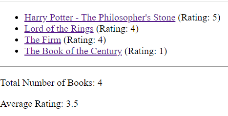
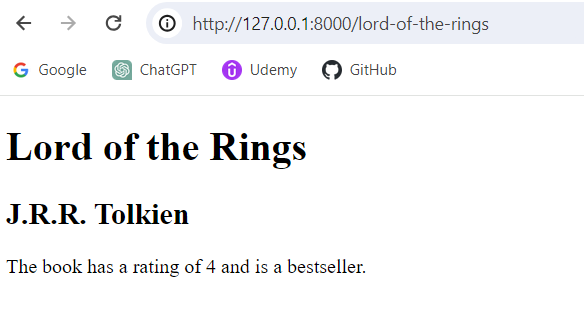

# Book Store - Django

## Description
A starter Django application which demonstrates using a sqlite database for rendering data and dynamic page routing using slugs.

### App Screenshots

#### All Books Page

#### Book Detail Page

## Contact Info
GitHub user name: BillStephens2022 
Link to GitHub profile: https://github.com/BillStephens2022 
Email: stephensbill17@gmail.com

